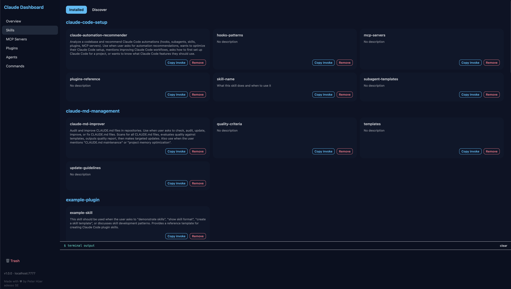

# Claude AI Power Tools Dashboard

Local web dashboard for managing Claude Code skills, MCP servers, plugins, and agents.



## Table of Contents

- [Plugin Installation](#plugin-installation)
- [Manual Installation](#manual-installation)
- [Usage](#usage)
- [Features](#features)
- [Architecture](#architecture)
- [Scripts](#scripts)
- [Security](#security)

---

## Plugin Installation

This repo is a valid Claude Code plugin. Install it directly from GitHub:

```bash
  claude plugin install dashboard@claude-dashboard
```

After install, `/dashboard:open` is available in every Claude Code session and opens the browser automatically.

---

## Manual Installation

### Prerequisites

- Node.js 18+
- macOS / Linux — bash available natively
- Windows — requires [Git Bash](https://git-scm.com/downloads) or WSL (does **not** work in `cmd.exe` or PowerShell)

### Setup

Clone the repo into `~/.claude/dashboard` and run the install script:

```bash
git clone https://github.com/PeterHueer/claude-dashboard ~/.claude/dashboard
bash ~/.claude/dashboard/install.sh
```

The install script runs `npm install` and makes all scripts executable.

---

## Usage

### Via Claude Code

Type `/dashboard:open` in any Claude Code session to start the server and open the browser.

### Via terminal

```bash
# Start (no-op if already running, opens browser)
bash ~/.claude/dashboard/scripts/start.sh

# Stop
bash ~/.claude/dashboard/scripts/stop.sh
```

Open manually: http://127.0.0.1:7777

---

## Features

- **Overview** — stat cards for all sections, click to navigate
- **Skills** — browse personal and plugin skills across three tabs: My Skills, Plugins, Discover
- **Skill discovery** — search [skills.sh](https://skills.sh) and browse All Time / Trending / Hot; install directly from the dashboard
- **MCP Servers** — view all active MCP server configurations with their source (global or plugin)
- **Plugins** — inspect installed plugins with type badges (skill / mcp)
- **Agents** — explore available agents across all installed plugins
- **Terminal panel** — live CLI output streamed to the browser for every action

---

## Architecture

### Stack

| Layer | Technology |
|-------|-----------|
| Server | Node.js + Express |
| Frontend | Vanilla JS, DaisyUI, Tailwind CSS |
| Data | Filesystem scan (no database) |

### Data sources

| Section | Source path |
|---------|------------|
| Skills (personal) | `~/.claude/skills/` |
| Skills (plugins) | `~/.claude/plugins/cache/{marketplace}/{plugin}/{version}/skills/` |
| MCP Servers | `~/.mcp.json`, plugin `.mcp.json` files |
| Plugins | `~/.claude/plugins/marketplaces/` |
| Agents | `~/.claude/plugins/marketplaces/*/plugins/*/agents/` |

### File structure

```
~/.claude/dashboard/
├── server.js              # Express entry point
├── lib/
│   ├── constants.js       # PORT, CLAUDE_DIR, TRASH_DIR
│   └── helpers.js         # Shared utilities
├── routes/
│   ├── discover.js        # GET /api/skills, /api/mcp, /api/plugins, /api/agents
│   ├── mutations.js       # DELETE /api/skills
│   ├── exec.js            # POST /api/exec
│   └── trash.js           # Trash management
├── public/
│   ├── index.html
│   └── js/
│       ├── core.js        # Navigation, API helpers, terminal
│       ├── overview.js
│       ├── skills.js
│       ├── mcp.js
│       ├── plugins.js
│       ├── agents.js
│       └── trash.js
├── scripts/
│   ├── start.sh           # Start server (cross-platform)
│   ├── stop.sh            # Stop server (cross-platform)
│   └── remove.sh          # Remove hooks + stop server
├── commands/
│   └── open.md            # /dashboard:open Claude Code command
└── .claude-plugin/
    └── plugin.json        # Plugin manifest
```

---

## Scripts

| Script | Description |
|--------|-------------|
| `scripts/start.sh` | Starts the server on port 7777 if not already running, then opens the browser. Cross-platform (macOS / Linux / Windows Git Bash). |
| `scripts/stop.sh` | Kills the process on port 7777. Cross-platform. |
| `scripts/remove.sh` | Removes any dashboard hooks from `~/.claude/settings.json` and stops the server. |
| `install.sh` | Runs `npm install` and makes scripts executable. |

---

## Security

- Server binds to `127.0.0.1` only — not accessible on the network
- `/api/exec` only allows two command patterns:
  - `claude plugin install/remove <package>`
  - `npx skills add <source>@<skillId>`
- All user input is HTML-escaped before rendering
